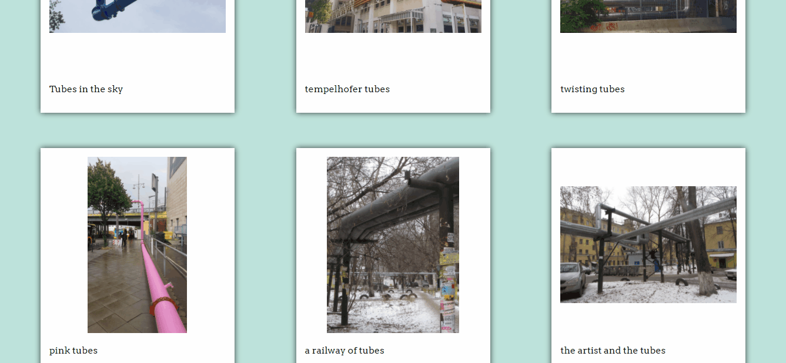

# TUBES IMAGEBOARD

## Description:

Instagram-inspired, single-page application website to collect tubes pictures from Berlin and Eastern Europe. Users can upload images and add comments to other images.

## Developed with:

-   Vue.js
-   Node.js
-   Express.js
-   axios
-   AWS S3
-   PostgreSQL
-   HTML/CSS

## Features

The users are shown the last most recent 6 pictures of the collection. Every time they click on the button "more" 6 more pictures are loaded, until the last picture is reached and the button disappears.

Users can upload new pictures from the top of the page, the images are stored in AWS.

If the users click on one picture, a modal opens, where they can see the picture in a larger size as well as leave a comment under the picture. By clicking on the modal again it closes again.

The users can move from a modal to the next or the previous with the arrows. If the users get to the first or the last picture, the arrow turns into a stop sign.

The users can share the link of a specific image thanks to hash routing.

